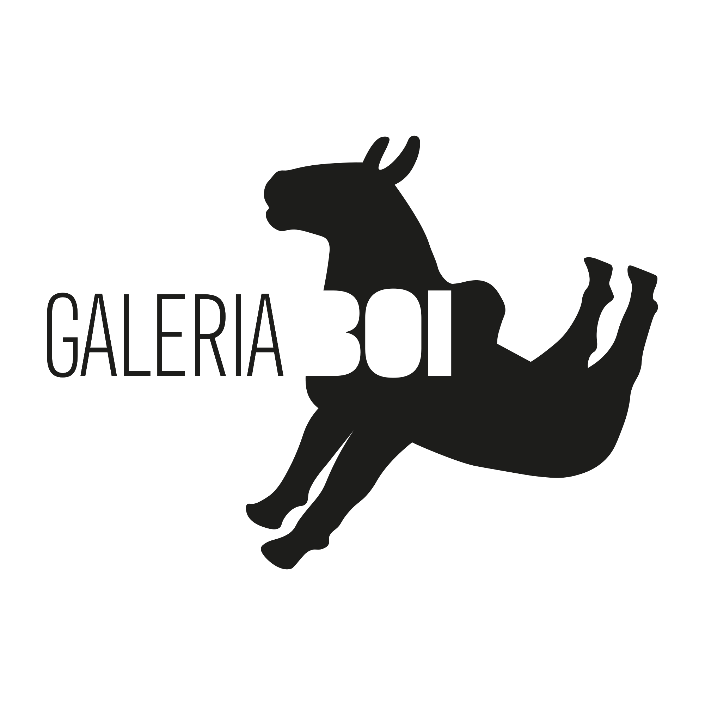

<html lang="pt-BR" class="scroll-smooth">
<head>
    <meta charset="UTF-8">
    <meta name="viewport" content="width=device-width, initial-scale=1.0">
    <title>Galeria Boi | Arte Contemporânea</title>
    
    <!-- Google Fonts -->
    <link rel="preconnect" href="https://fonts.googleapis.com">
    <link rel="preconnect" href="https://fonts.gstatic.com" crossorigin>
    <link href="https://fonts.googleapis.com/css2?family=Inter:wght@300;400;500&family=Playfair+Display:ital,wght@0,400;0,600;1,400&display=swap" rel="stylesheet">
    
    <!-- Tailwind CSS -->
    
    
    

    
</head>
<body class="antialiased selection:bg-gallery-black selection:text-white">

    <!-- Navegação -->
    <nav id="navbar" class="fixed top-0 w-full z-[99] transition-all duration-300 pointer-events-none">
        

            
            <!-- Logo em Imagem (Apenas 'invert' para ficar branca no topo escuro) -->
            
            
            <!-- Desktop Links -->
            

                <a href="#acervo" class="hover:opacity-60 transition-opacity">Acervo</a>
                <a href="#sobre" class="hover:opacity-60 transition-opacity">A Galeria</a>
            

            
            <!-- Mobile Menu Button -->
            

                <button onclick="toggleMobileMenu()" class="uppercase text-xs tracking-widest hover:opacity-70 transition-opacity">Menu</button>
            

        

    </nav>

    <!-- Menu Mobile Overlay -->
    

        <button onclick="toggleMobileMenu()" class="absolute top-6 right-6 p-4 uppercase text-xs tracking-widest opacity-70 hover:opacity-100">Fechar</button>
        

            <a href="#acervo" onclick="toggleMobileMenu()" class="hover:text-gallery-gray transition-colors">Acervo</a>
            <a href="#sobre" onclick="toggleMobileMenu()" class="hover:text-gallery-gray transition-colors">A Galeria</a>
            <a href="mailto:contato@galeriaboi.com" class="hover:text-gallery-gray transition-colors">Contato</a>
        

    

    <!-- Hero Section -->
    <section id="hero" class="w-full min-h-screen flex flex-col lg:flex-row relative bg-gallery-white">
        <!-- Lado do Texto -->
        

            

                
Acervo Permanente

                <h1 class="text-6xl md:text-7xl lg:text-[5.5rem] font-serif leading-none mb-10">NOVA FORNOS</h1>
                

                    Um catálogo imersivo dos artistas mais proeminentes da nossa curadoria. Deslize para baixo para conhecer os criadores e horizontalmente para explorar suas respectivas mini galerias.
                

                <a href="#acervo" class="inline-flex items-center gap-4 text-sm uppercase tracking-widest font-medium group pb-2 border-b border-gallery-black/20 hover:border-gallery-black transition-colors">
                    Explorar Acervo
                    ↓
                </a>
            

        

        <!-- Lado da Imagem com o ficheiro galeria.jpg -->
        

            
        

    </section>

    <!-- Seção Principal: Artistas e Mini Galerias -->
    <section id="acervo" class="pt-24 pb-16 bg-gallery-white w-full">
        

            
            

                <h2 class="text-4xl md:text-5xl font-serif mb-8 md:mb-12">Nossos Artistas</h2>
                

                

                    ←
                    
Deslize ou arraste as obras horizontalmente

                    →
                

            

            <!-- O JavaScript injetará os artistas aqui -->
            

        

    </section>

    <!-- Rodapé PRETO -->
    <footer id="sobre" class="bg-gallery-black text-white py-24 px-8 md:px-16 mt-12 w-full">
        

            

                <!-- Logo no Rodapé (Apenas 'invert' para ficar branca) -->
                
                
Dedicada a expor as narrativas visuais mais instigantes da arte contemporânea, com exposições imersivas e curatoriais focadas no diálogo entre a materialidade e o espaço.

            

            
            

                <h4 class="uppercase tracking-widest text-xs font-semibold mb-6 text-white w-full">Localização</h4>
                

                    Travessa Mestre Vitalino, 9a 
                    Alto do Moura, Caruaru - PE 
                    Ter - Sáb, 11h às 19h
                

            

            
            

                <h4 class="uppercase tracking-widest text-xs font-semibold mb-6 text-white w-full">Contato</h4>
                <ul class="text-sm text-gray-400 font-light space-y-3 w-full p-0 m-0">
                    <li><a href="mailto:contato@galeriaboi.com" class="hover:text-white transition-colors">contato@galeriaboi.com</a></li>
                    <li><a href="#" class="hover:text-white transition-colors">+55 11 9999-0000</a></li>
                    <li><a href="https://www.instagram.com/galeriaboi/" target="_blank" rel="noopener noreferrer" class="hover:text-white transition-colors">Instagram</a></li>
                </ul>
            

        

        

            
&copy; 2026 Galeria Boi. Todos os direitos reservados.

            
Design web otimizado

        

    </footer>

    <!-- Modal Tela Cheia (Lightbox) -->
    

        <!-- Botão Fechar -->
        <button aria-label="Fechar galeria" onclick="closeLightbox()" class="absolute top-4 right-4 lg:top-8 lg:right-8 z-[120] p-4 group cursor-pointer bg-white/50 lg:bg-transparent rounded-full backdrop-blur-md lg:backdrop-blur-none">
            
            
        </button>

        <!-- Área da Imagem -->
        

            
            
            <button aria-label="Obra anterior" onclick="prevImage(event)" class="absolute left-2 lg:left-8 top-1/2 -translate-y-1/2 p-3 lg:p-4 text-2xl lg:text-3xl font-serif text-gallery-black lg:text-gallery-gray lg:hover:text-gallery-black bg-white/70 rounded-full backdrop-blur-md transition-all cursor-pointer z-10 shadow-sm">←</button>
            <button aria-label="Próxima obra" onclick="nextImage(event)" class="absolute right-2 lg:right-8 top-1/2 -translate-y-1/2 p-3 lg:p-4 text-2xl lg:text-3xl font-serif text-gallery-black lg:text-gallery-gray lg:hover:text-gallery-black bg-white/70 rounded-full backdrop-blur-md transition-all cursor-pointer z-10 shadow-sm">→</button>
        

        <!-- Área de Informações -->
        

            Artista
            <h2 id="lb-title" class="text-2xl lg:text-3xl font-serif mb-2 leading-tight">Título</h2>
            
Ano

            
            

                

                    <strong class="block text-gallery-black uppercase tracking-widest text-[10px] mb-1">Técnica</strong>
                    
                

                

                    <strong class="block text-gallery-black uppercase tracking-widest text-[10px] mb-1">Dimensões</strong>
                    
                

            

            

                <button class="w-full py-4 border border-gallery-black text-xs uppercase tracking-widest font-sans hover:bg-gallery-black hover:text-white transition-colors duration-300 cursor-pointer">
                    Solicitar Valor
                </button>
            

        

    

    <!-- JAVASCRIPT -->
    
</body>
</html>
